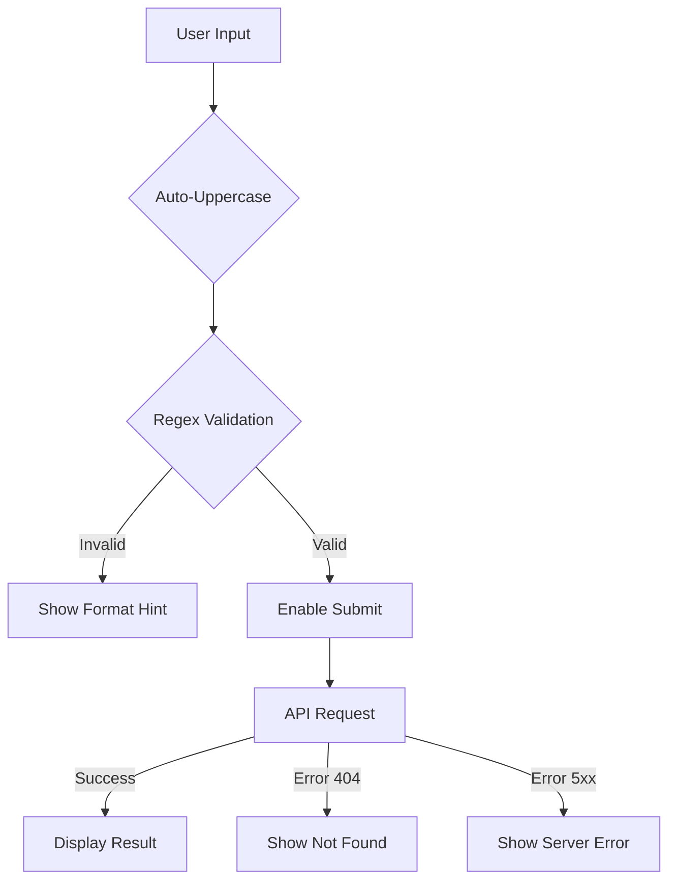

# E-Coupon Verification Page

## 📋 Overview

A **public, read-only** verification page that allows anyone to verify coupon book numbers or individual coupon codes without authentication.

⚠️ **Important Security Notes:**

- ✅ **NO authentication required** - fully public access
- ✅ **NO data mutation** - strictly read-only
- ✅ **Privacy-protected** - owner information is masked

---

## 🎯 Features

### 1. **Dual Input Support**

- Verify **Buku Kupon**: `BUKU-00001` format
- Verify **Individual Kupon**: `KPN-00007` format

### 2. **Smart Input Validation**

- Auto-uppercase transformation
- Regex pattern validation
- Real-time format feedback
- Disabled submit until valid format

### 3. **Auto-Verification from URL**

- Direct link verification: `/verify/KPN-00007`
- QR code compatible
- Shareable verification links

### 4. **Status Display**

- ✅ **Valid** (green) - Dapat digunakan
- ⚠️ **Claimed** (yellow) - Sudah digunakan
- ❌ **Void** (red) - Tidak berlaku

### 5. **Privacy-Protected Owner Info**

- Name: `Stev** Reu***` (masked)
- Phone: `0812****890` (masked)

### 6. **User Experience**

- Copy-to-clipboard functionality
- Mobile-first responsive design
- Clear error messages
- Loading states
- Help section

---

## 🚀 Usage

### Access Methods

1. **Manual Input**

   ```
   Navigate to: /verify
   Enter code: BUKU-00001 or KPN-00007
   Click: Verifikasi
   ```

2. **Direct URL**

   ```
   /verify/BUKU-00001
   /verify/KPN-00007
   ```

3. **QR Code**
   - Scan QR code on physical coupon
   - Redirects to `/verify/{code}`
   - Auto-verifies

---

## 🔧 Technical Details

### Files Created

1. **`src/api/verification.ts`**

   - API client for verification endpoint
   - TypeScript interfaces for type safety
   - Error handling

2. **`src/pages/VerificationPage.tsx`**

   - Main verification component
   - Input validation logic
   - Result display components
   - 450+ lines of clean, commented code

3. **`src/App.tsx`** (updated)
   - Added verification routes
   - URL parameter support

### API Integration

**Endpoint:** `GET /api/verification/:code`

**Request:**

```typescript
GET / api / verification / KPN - 00007;
```

**Success Response:**

```json
{
  "type": "COUPON",
  "code": "KPN-00007",
  "status": "valid",
  "bookCode": "BUKU-00001",
  "owner": {
    "name": "Stev** Reu***",
    "phone": "0812****890"
  }
}
```

**Error Response:**

```json
{
  "error": "Code not found"
}
```

### Validation Patterns

```typescript
// Book format: BUKU-##### (5 digits)
const BOOK_PATTERN = /^BUKU-\d{5}$/;

// Coupon format: KPN-##### (5 digits)
const COUPON_PATTERN = /^KPN-\d{5}$/;
```

### Component Structure

```
VerificationPage
├── Button (utility component)
├── StatusBadge (status indicator)
├── VerificationResult (detailed display)
└── Main page logic
    ├── Instructions section
    ├── Input form with validation
    ├── Error display
    ├── Result display
    └── Help section
```

---

## 🎨 Design System

### Colors

- **Valid**: Green (`bg-green-50`, `text-green-700`)
- **Claimed**: Yellow (`bg-yellow-50`, `text-yellow-700`)
- **Void**: Red (`bg-red-50`, `text-red-700`)
- **Primary**: Blue (`bg-blue-600`)
- **Neutral**: Slate shades

### Typography

- Headers: `font-bold`, `text-2xl` / `text-xl`
- Body: `text-slate-600`, `text-sm` / `text-base`
- Codes: `font-mono`, `font-bold`, `text-blue-600`

### Spacing

- Mobile-first with responsive padding
- Consistent `gap-3` / `gap-4` / `gap-6`
- Sections separated with `mb-6` / `mb-8`

---

## 📱 Responsive Design

### Breakpoints

- **Mobile**: Default layout
- **Tablet**: `sm:` prefix (640px+)
- **Desktop**: `lg:` prefix (1024px+)

### Container

```tsx
max-w-3xl mx-auto px-4 sm:px-6 lg:px-8
```

---

## ✅ Validation Flow



---

## 🔒 Security Considerations

### What's Protected

✅ Owner names are masked (partial display)  
✅ Phone numbers are masked (partial display)  
✅ No data modification possible  
✅ No authentication bypass risk

### What's Public

- Coupon status (valid/claimed/void)
- Coupon and book codes
- Type information (book vs coupon)

### API Security Notes

- Backend should implement rate limiting
- Backend handles data masking
- Frontend only displays received data
- No sensitive operations possible

---

## 🧪 Testing Checklist

### Functional Tests

- [ ] Valid book code verification
- [ ] Valid coupon code verification
- [ ] Invalid format rejection
- [ ] Error handling (404, 5xx)
- [ ] Copy-to-clipboard functionality
- [ ] URL parameter auto-verification
- [ ] Navigation (back button, reset)

### UX Tests

- [ ] Mobile responsive layout
- [ ] Touch-friendly buttons
- [ ] Loading states visible
- [ ] Error messages clear
- [ ] Instructions easy to understand

### Edge Cases

- [ ] Lowercase input (auto-uppercase)
- [ ] Extra spaces (auto-trim)
- [ ] Network errors
- [ ] Slow API response
- [ ] Direct URL with invalid code

---

## 🚦 Deployment Checklist

- [x] TypeScript compilation successful
- [x] No ESLint errors
- [x] Responsive design implemented
- [x] Error handling comprehensive
- [x] Comments and documentation added
- [ ] Backend API tested
- [ ] Rate limiting configured
- [ ] QR code generation setup
- [ ] Analytics tracking (optional)

---

## 📚 Usage Examples

### Example 1: Verify Book

```
Input: BUKU-00001
Result: Shows book status + owner info
```

### Example 2: Verify Coupon

```
Input: KPN-00007
Result: Shows coupon status + book code + owner info
```

### Example 3: Invalid Code

```
Input: INVALID-123
Error: "Format kode tidak valid"
```

### Example 4: Not Found

```
Input: KPN-99999
Error: "Kode tidak ditemukan dalam sistem"
```

---

## 🛠️ Future Enhancements (Optional)

- [ ] QR code scanner integration (camera access)
- [ ] Bulk verification (upload CSV)
- [ ] Verification history (local storage)
- [ ] Share verification result
- [ ] Print verification certificate
- [ ] Multi-language support
- [ ] Dark mode

---

## 📞 Support

For questions or issues:

1. Check format: `BUKU-00001` or `KPN-00007`
2. Verify network connection
3. Contact panitia via WhatsApp

---

## 📄 License & Credits

**Project:** E-Coupon System  
**Component:** Public Verification Page  
**Framework:** React + TypeScript + Tailwind CSS  
**Date:** January 2026

---

**Status:** ✅ Ready for Production Deployment
